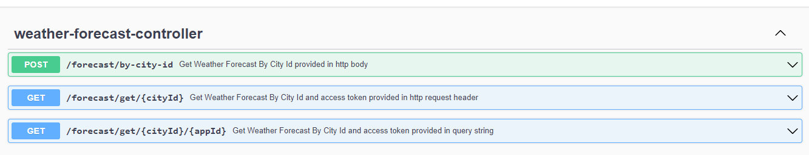

## spring-boot-weather-forecast-client-api

Purpose : Use openweathermap in spring boot API  

### Local run steps  
1- Start Spring Boot REST API by running main method containing class WeatherForecastClientAPI.java in your IDE.  
<pre> 
spring-boot-weather-forecast-client-api $ mvn clean install -U -X  
</pre>

swagger_ui can be accessed via http port 8082 from localhost :  
http://localhost:8082/weather-forecast/swagger-ui/index.html#/   
   

### Tech Stack
<pre>
Java 17
H2 Database Engine
spring boot
spring boot starter data jpa
spring boot starter web
spring boot starter test
springdoc openapi ui
springfox swagger ui
logback
maven
mockito-core
mockito-junit-jupiter
mockito-inline
</pre>

## API OPERATIONS
### Operation 1 : Get Weather Forecast By City Id provided in http body
NOT: In this scenario access token is in the application.properties file.

Method : HTTP.POST  
URL : http://localhost:8082/weather-forecast/forecast/by-city-id  
HTTP Request Body :  
<pre>
{
    "cityId": 524901
}
</pre>

Curl Request :  
<pre>
curl --location 'http://localhost:8082/weather-forecast/forecast/by-city-id' \
--header 'Content-Type: application/json' \
--data '{
    "cityId": 524901
}'
</pre> 

Response :

HTTP response code 200  
<pre>
{
    "maxFeelsLike": 283.48,
    "maxHumidity": 96
}
</pre>

### Operation 2 : Get Weather Forecast By City Id and access token provided in query string
NOT: In this scenario access token is provided in the query string directly.

Method : HTTP.GET  
URL : http://localhost:8082/weather-forecast/forecast/get/524901/4d918421e250e65043de409947a79b28  
Request Body :  
<pre>
{}
</pre>
Curl Request :  
<pre>
curl --location 'http://localhost:8082/weather-forecast/forecast/get/524901/4d918421e250e65043de409947a79b28'
</pre>
 

Response :

HTTP response code 200  
<pre>
{
    "maxFeelsLike": 283.48,
    "maxHumidity": 96
}
</pre>
 

### Operation 3 : Get Weather Forecast By City Id and access token provided in http request header
NOT: In this scenario access token is provided in the http Authorization request header

Method : HTTP.GET  
URL : http://localhost:8082/weather-forecast/forecast/get/524901  
Request Body :  
<pre>
{}
</pre>
Curl Request :  
<pre>
curl --location 'http://localhost:8082/weather-forecast/forecast/get/524901' \
--header 'ACCESS-TOKEN: 4d918421e250e65043de409947a79b28'
</pre>
 

Response :

HTTP response code 200  
<pre>
{
    "maxFeelsLike": 283.48,
    "maxHumidity": 96
}
</pre>
 

